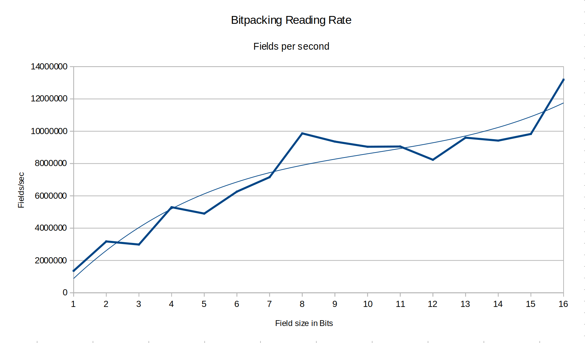
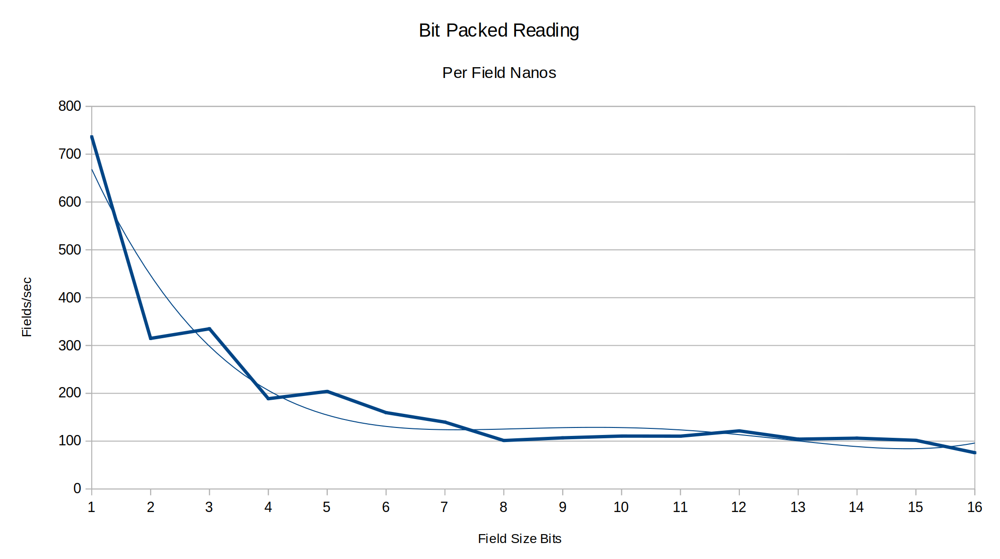
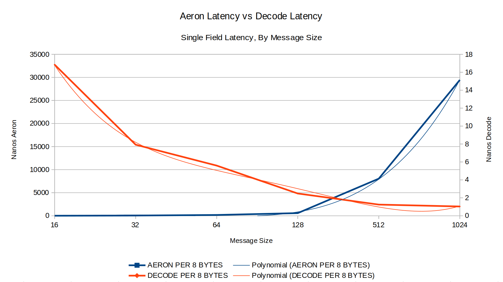
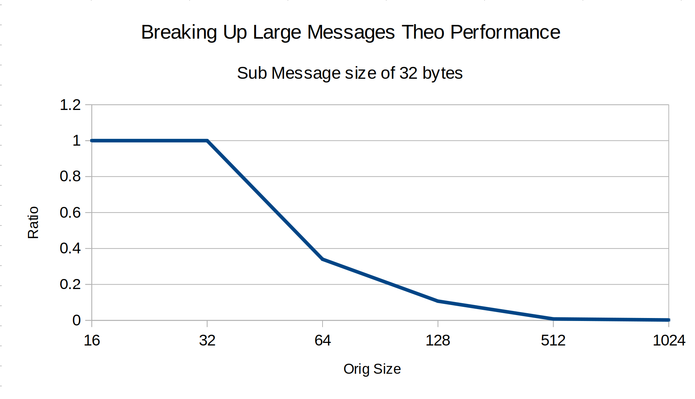

# marketdata-analysis
Analysis of market data in context of optimising SBE-Aeron stack

CPU: Intel(R) Core(TM) i7-6560U CPU @ 2.20GHz
Num cores: 4
Num iterations per samples: 1000
Num samples: 300

1) CAS latency on a single shared cache line
    Min  latency: 10.3ns ±0.4 cores: (3,1)
    Max  latency: 54.2ns ±2.7 cores: (1,0)
    Mean latency: 24.9ns
    
    
_**Please Note: Your mileage may vary**_
    
Using the above hardware, I conduct a number of tests (some of which are found in [jmh-playground](https://github.com/bhf/jmh-playground):

* Aeron raw message rate just sending bytes of different sizes
* Reading longs out of an Unsafe buffer
* Hoisting data out of an Unsafe buffer
* Testing the rate at which fields can be read by bit packing

I also used iextrading4j with HDRHistogram to build distributions of the 
number of relevant messages (price level updates and quotes) per packet. I used IEX as 
the pcap data is [freely available online](https://iextrading.com/trading/market-data/)
For that particular venue there is only approx 1% of packets where there are multiple messages. 

In conclusion, I found reading bit packed fields much slower in comparison to just reading longs 
out of an UnsafeBuffer. 

 

 

The rate of performance degredation with message size increase in
the Aeron stack is offset by the ammortization of the long decoding for larger message sizes.

 

When we calculate the theoretical difference between sending a single large
message vs breaking up that message into smaller messages, we see that the larger
the original message the more benefit we can get by breaking up the message.

 

Whilst this is not that great of a performance booster for the sample IEX data,
it illustrates the approach and benefit that could occur for venues which produce
more updates and at a much faster rate.

